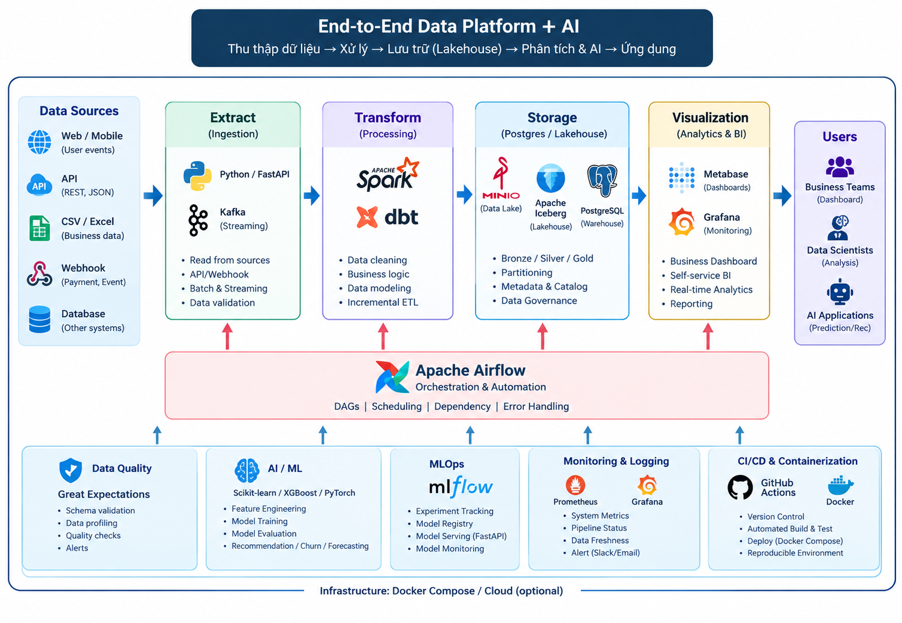
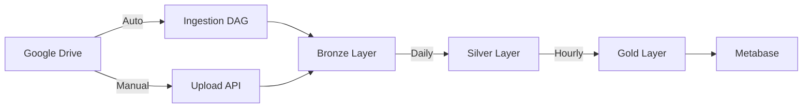

<div align="center">

# 🌐 DATA PLATFORM: NỀN TẢNG KỸ THUẬT DỮ LIỆU DOANH NGHIỆP

**Nền tảng xử lý dữ liệu end-to-end** cho **ETL** → **Data Warehouse** → **Business Intelligence** với kiến trúc cloud-native và chi phí tối thiểu.

<br/>


<br/>
<sub>☁️ Cloud Native  •  💰 Chi phí thấp  •  🔄 Bronze → Silver → Gold  •  📊 Business Intelligence  •  🐳 Docker Ready</sub>

</div>

---

<div align="center">



*Nền tảng data pipeline cấp doanh nghiệp - Từ thu thập đến Business Intelligence*

</div>

---

## 📌 Mục Lục

<details open>
<summary><b>📚 Điều hướng nhanh</b></summary>

- [📝 Tóm tắt](#-tóm-tắt)
- [🏗️ Kiến trúc hệ thống](#️-kiến-trúc-hệ-thống)
- [🔄 Luồng dữ liệu](#-luồng-dữ-liệu)
- [✨ Tính năng chính](#-tính-năng-chính)
- [🛠️ Tech Stack](#️-tech-stack)
- [📁 Cấu trúc dự án](#-cấu-trúc-dự-án)
- [🚀 Cài đặt nhanh](#-cài-đặt-nhanh)
- [📖 Hướng dẫn sử dụng](#-hướng-dẫn-sử-dụng)
- [🔧 Cấu hình](#-cấu-hình)
- [📚 Tài liệu chi tiết](#-tài-liệu-chi-tiết)
- [🔗 Liên kết](#-liên-kết)
- [👥 Đội ngũ](#-đội-ngũ)

</details>

---

## 📝 Tóm tắt

**Data Platform** là một hệ thống xử lý dữ liệu end-to-end được thiết kế cho doanh nghiệp vừa và nhỏ. Hệ thống sử dụng các công nghệ **cloud-native miễn phí**, cho phép bắt đầu với chi phí thấp và mở rộng theo nhu cầu.

### 🎯 Mục tiêu chính

- 📥 **Thu thập dữ liệu đa nguồn** — Google Drive, REST API, CSV/Excel upload
- 🔄 **Xử lý ETL** — Transform dữ liệu với dbt và Apache Spark
- 🏠 **Kiến trúc Lakehouse** — Bronze → Silver → Gold với Delta Lake
- 📊 **Business Intelligence** — Dashboard tương tác với Metabase
- 🔧 **Orchestration** — Tự động hóa pipeline với Apache Airflow
- 🌐 **REST API** — Truy cập dữ liệu qua FastAPI

---

## 🏗️ Kiến trúc hệ thống

```
┌─────────────────────────────────────────────────────────────────────┐
│                      DATA PLATFORM ARCHITECTURE                     │
├─────────────────────────────────────────────────────────────────────┤
│                                                                     │
│  ┌─────────────┐    ┌─────────────┐    ┌─────────────────────────┐ │
│  │   Sources   │    │   Sources   │    │      Sources           │ │
│  │  Google     │    │  REST API   │    │  Manual Upload        │ │
│  │  Drive      │    │  (JSON)     │    │  (CSV/Excel)          │ │
│  └──────┬──────┘    └──────┬──────┘    └───────────┬─────────────┘ │
│         │                   │                      │               │
│         └───────────────────┼──────────────────────┘               │
│                             ▼                                      │
│                   ┌─────────────────┐                             │
│                   │  INGESTION      │                             │
│                   │  Layer          │                             │
│                   │  (Python/pyspark)│                             │
│                   └────────┬────────┘                             │
│                            ▼                                       │
│         ┌──────────────────────────────────────┐                  │
│         │          DELTA LAKE                  │                  │
│         │         (Databricks DBFS)            │                  │
│         │                                      │                  │
│         │  ┌────────┐  ┌────────┐  ┌────────┐  │                  │
│         │  │Bronze │─▶│Silver │─▶│  Gold  │  │                  │
│         │  │ (Raw) │  │(Clean)│  │(Biz)  │  │                  │
│         │  └────────┘  └────────┘  └────────┘  │                  │
│         └──────────────────────────────────────┘                  │
│                            │                                       │
│         ┌─────────────────┼─────────────────┐                    │
│         ▼                 ▼                 ▼                     │
│  ┌────────────┐   ┌────────────┐   ┌────────────┐               │
│  │   dbt      │   │  Metabase  │   │  FastAPI  │               │
│  │Transform   │   │  Dashboard │   │   REST    │               │
│  │ (SQL)      │   │   (BI)     │   │   (API)   │               │
│  └────────────┘   └────────────┘   └────────────┘               │
│                            │                                       │
│                            ▼                                       │
│                   ┌─────────────────┐                             │
│                   │   AIRFLOW       │                             │
│                   │   Orchestration │                             │
│                   └─────────────────┘                             │
│                                                                     │
└─────────────────────────────────────────────────────────────────────┘
```

### 📊 Mô hình dữ liệu (Bronze → Silver → Gold)

| Layer | Mô tả | Nguồn dữ liệu | Chất lượng |
|-------|-------|----------------|------------|
| **Bronze** | Dữ liệu thô, giữ nguyên format gốc | Google Drive, API | Raw, chưa validate |
| **Silver** | Dữ liệu đã clean và standardize | Bronze layer | Clean, validate, schema enforced |
| **Gold** | Dữ liệu business-ready cho BI | Silver layer | Curated, aggregated, business metrics |

---

## 🔄 Luồng dữ liệu

```
┌──────────┐    ┌───────────┐    ┌─────────┐    ┌─────────┐    ┌───────────┐
│  Google  │    │ Ingestion │    │ Bronze  │    │ Silver  │    │   Gold    │
│  Drive   │───▶│  Layer    │───▶│ Delta   │───▶│  Delta  │───▶│  Delta    │
│  (Raw)   │    │  (Python) │    │  Lake   │    │  Lake   │    │   Lake    │
└──────────┘    └───────────┘    └─────────┘    └─────────┘    └───────────┘
                                                        │            │
                                                        ▼            ▼
                                              ┌─────────────────┐  ┌─────────┐
                                              │      dbt        │  │Metabase │
                                              │  Transformation │  │Dashboard │
                                              └─────────────────┘  └─────────┘
                                                        │
                                                        ▼
                                              ┌─────────────────┐
                                              │    FastAPI      │
                                              │    REST API     │
                                              └─────────────────┘
```

### 📋 Chi tiết từng giai đoạn

| Giai đoạn | Công nghệ | Mô tả |
|-----------|-----------|--------|
| **Ingestion** | Python, pandas, pyspark | Đọc từ Google Drive, REST API, upload files |
| **Bronze** | Delta Lake | Lưu dữ liệu thô với ACID transactions |
| **Silver** | dbt | Clean, standardize, join, aggregate |
| **Gold** | dbt | Business metrics, data marts |
| **Analytics** | Metabase | Dashboard trực quan hóa |
| **API** | FastAPI | Truy cập dữ liệu qua REST |
| **Orchestration** | Airflow | Lập lịch và giám sát pipeline |

---

## ✨ Tính năng chính

### 📥 Data Ingestion

| Tính năng | Mô tả |
|-----------|--------|
| 🌐 **Google Drive Integration** | Tự động đọc CSV/Excel từ Shared Drive |
| 📡 **REST API Support** | Nhận dữ liệu JSON qua endpoint |
| 📁 **Manual Upload** | Upload trực tiếp qua FastAPI |
| ✔️ **Schema Validation** | Kiểm tra schema tự động khi import |

### 🔄 Data Transformation (dbt)

| Tính năng | Mô tả |
|-----------|--------|
| 🏗️ **Incremental Models** | Chỉ xử lý dữ liệu mới |
| 🧪 **Data Tests** | Kiểm tra chất lượng dữ liệu tự động |
| 📊 **Snapshots** | Theo dõi thay đổi (SCD Type 2) |
| 🔗 **Ref & Jinja** | Tái sử dụng logic, DRY principle |

### 📊 Business Intelligence

| Tính năng | Mô tả |
|-----------|--------|
| 📈 **Dashboard** | Biểu đồ tương tác, filter theo thời gian |
| 👥 **Multi-user** | Phân quyền xem dashboard |
| 📱 **Embedding** | Nhúng dashboard vào ứng dụng khác |
| 🔔 **Alerts** | Cảnh báo khi metrics vượt ngưỡng |

### 🔧 Orchestration (Airflow)

| Tính năng | Mô tả |
|-----------|--------|
| ⏰ **Scheduling** | Chạy pipeline theo lịch (hourly, daily) |
| 📊 **Monitoring** | Theo dõi trạng thái DAG execution |
| 🔄 **Retry** | Tự động retry khi fail |
| 📧 **Notifications** | Gửi alert qua Email/Slack |

---

## 🛠️ Tech Stack

### 🗄️ Storage Layer

| Technology | Purpose | Notes |
|------------|---------|-------|
| **Google Drive** | Raw Data Storage | Free Shared Drive (15GB) |
| **Databricks DBFS** | Delta Lake Storage | Free tier: 20GB |
| **Delta Lake** | Data Lakehouse | ACID transactions |

### ⚙️ Processing Layer

| Technology | Purpose | Notes |
|------------|---------|-------|
| **Databricks Community** | Data Processing | Free forever |
| **Apache Spark** | Distributed Computing | Built-in |
| **Python 3.11** | Scripting | pandas, pyspark |
| **dbt-databricks** | Data Transformation | SQL-based, version control |

### 🎛️ Orchestration

| Technology | Purpose | Notes |
|------------|---------|-------|
| **Apache Airflow** | Workflow Orchestration | Local Docker |
| **Docker Compose** | Container Management | Local dev |

### 📊 Analytics & BI

| Technology | Purpose | Notes |
|------------|---------|-------|
| **Metabase** | Dashboard & BI | Free, Mac-friendly |
| **SQL** | Query Language | Databricks SQL |

### 🌐 API Layer

| Technology | Purpose | Notes |
|------------|---------|-------|
| **FastAPI** | REST API | Python async |
| **Pydantic** | Data Validation | Type safety |

### 📝 Logging & Monitoring

| Technology | Purpose | Notes |
|------------|---------|-------|
| **Loguru** | Application logs | Easy logging |
| **Loki** | Log aggregation | Lightweight |
| **Grafana** | Metrics visualization | Optional |

---

## 📁 Cấu trúc dự án

```
data-platform/
├── 📁 apps/                          # Application code
│   ├── 📁 api/                       # FastAPI application
│   │   ├── 📁 routers/              # API endpoints
│   │   ├── 📁 schemas/              # Pydantic models
│   │   └── 📁 services/             # Business logic
│   └── 📁 web/                      # Web interface (future)
│
├── 📁 libs/                         # Shared libraries
│   ├── 📁 ingestion/                # Data ingestion scripts
│   │   ├── 📁 connectors/          # Google Drive, API connectors
│   │   ├── 📁 validators/          # Schema validation
│   │   └── 📁 loaders/             # Delta Lake loaders
│   ├── 📁 transformation/         # dbt models
│   │   ├── 📁 models/              # dbt models (bronze/silver/gold)
│   │   ├── 📁 macros/              # Jinja macros
│   │   └── 📁 seeds/               # Static data
│   └── 📁 utils/                    # Utilities
│       ├── 📁 logging/             # Logging configuration
│       └── 📁 config/               # Config management
│
├── 📁 airflow/                       # Airflow configuration
│   ├── 📁 dags/                    # DAG definitions
│   │   ├── 📁 ingestion/           # Ingestion DAGs
│   │   └── 📁 transformation/     # Transformation DAGs
│   └── 📁 plugins/                 # Custom Airflow plugins
│
├── 📁 docs/                         # Documentation
│   ├── 📁 architecture/            # Architecture docs
│   ├── 📁 setup/                   # Setup guides
│   ├── 📁 pipelines/              # Pipeline docs
│   └── 📁 runbooks/                # Operations guides
│
├── 📁 scripts/                      # Shell scripts
│   ├── 📁 setup/                   # Setup scripts
│   └── 📁 utils/                   # Utility scripts
│
├── 📁 tests/                        # Test suite
│   ├── 📁 unit/                    # Unit tests
│   ├── 📁 integration/             # Integration tests
│   └── 📁 fixtures/                # Test fixtures
│
├── 📄 docker-compose.yml            # Container orchestration
├── 📄 Dockerfile                    # Docker image
├── 📄 requirements.txt              # Python dependencies
├── 📄 .env.example                 # Environment template
└── 📄 README.md                    # This file
```

---

## 🚀 Cài đặt nhanh

### 📋 Yêu cầu hệ thống

| Yêu cầu | Phiên bản | Mục đích |
|---------|-----------|-----------|
| **Python** | 3.11+ | Môi trường chính |
| **Docker Desktop** | 4.0+ | Container runtime |
| **Git** | 2.0+ | Version control |

### 🔧 Hướng dẫn cài đặt từng bước

#### 1️⃣ Clone Repository
```bash
git clone https://github.com/viet-du/data-platfrom.git
cd data-platfrom
```

#### 2️⃣ Tạo Virtual Environment
```bash
# Tạo venv
python -m venv venv

# Kích hoạt
source venv/bin/activate  # macOS/Linux
# hoặc
.venv\Scripts\activate     # Windows
```

#### 3️⃣ Cài đặt Dependencies
```bash
pip install -r requirements.txt
```

#### 4️⃣ Cấu hình Environment Variables
```bash
cp .env.example .env
```

Chỉnh sửa file `.env`:
```env
# Databricks
DATABRICKS_HOST=https://dbc-xxxxx.cloud.databricks.com
DATABRICKS_TOKEN=dapi...
DATABRICKS_HTTP_PATH=/sql/1.0/warehouses/...

# Google Drive
GOOGLE_DRIVE_CREDENTIALS_PATH=./configs/google-drive-credentials.json
GOOGLE_DRIVE_FOLDER_ID=...

# Logging
LOG_LEVEL=INFO
LOG_DIR=./logs
```

#### 5️⃣ Setup Google Drive API

1. Truy cập [Google Cloud Console](https://console.cloud.google.com)
2. Tạo project mới
3. Enable **Google Drive API**
4. Tạo **Service Account**
5. Download credentials JSON
6. Share Google Drive folder với service account email

Xem chi tiết: [Google Drive Setup Guide](docs/setup/google-drive-setup.md)

#### 6️⃣ Khởi động Services
```bash
docker-compose up -d
```

#### 7️⃣ Verify Installation
```bash
# Kiểm tra services
docker-compose ps

# Kiểm tra Airflow
curl http://localhost:8080

# Kiểm tra Metabase
curl http://localhost:3000
```

---

## 📖 Hướng dẫn sử dụng

### 🌐 Truy cập Dashboard

| Service | URL | Default Login |
|---------|-----|---------------|
| **Airflow** | http://localhost:8080 | airflow / airflow |
| **Metabase** | http://localhost:3000 | admin@email.com / admin |
| **FastAPI Docs** | http://localhost:8000/docs | — |

### 📥 Ingestion Workflow



#### Auto Ingestion (Google Drive)
1. Upload file CSV/Excel vào Google Drive folder
2. Airflow DAG tự động chạy theo lịch
3. Dữ liệu được load vào Bronze layer

#### Manual Upload (FastAPI)
```bash
curl -X POST "http://localhost:8000/api/v1/upload" \
  -H "Content-Type: multipart/form-data" \
  -F "file=@data.csv"
```

### 🔄 Transformation với dbt

```bash
# Chạy tất cả models
dbt run

# Chạy specific model
dbt run --select silver.my_model

# Test models
dbt test

# Generate documentation
dbt docs generate
dbt docs serve
```

### 📊 Metabase Dashboard

1. Mở http://localhost:3000
2. Đăng nhập với admin credentials
3. Connect Databricks as database
4. Tạo questions và dashboards

---

## 🔧 Cấu hình

### ⚙️ Databricks Configuration

**File:** `.env`

```env
DATABRICKS_HOST=https://dbc-xxxxx.cloud.databricks.com
DATABRICKS_TOKEN=dapixxxxxxxxxxxxxxxxxxxx
DATABRICKS_HTTP_PATH=/sql/1.0/warehouses/xxxxxxxxxxxxxxxx
```

Lấy credentials từ [Databricks Community](https://community.cloud.databricks.com):

1. Đăng nhập → Clusters → Create
2. SQL Warehouse → Create
3. Connection Details → Copy credentials

### 📁 dbt Configuration

**File:** `libs/transformation/dbt_project.yml`

```yaml
name: data_platform
version: 1.0.0

profile: databricks

models:
  data_platform:
    bronze:
      +materialized: table
    silver:
      +materialized: incremental
    gold:
      +materialized: table
```

### 🔄 Airflow DAG Configuration

**File:** `airflow/dags/ingestion_dag.py`

```python
from datetime import datetime, timedelta
from airflow import DAG

default_args = {
    'owner': 'data-platform',
    'depends_on_past': False,
    'start_date': datetime(2024, 1, 1),
    'retries': 3,
    'retry_delay': timedelta(minutes=5),
}

dag = DAG(
    'data_ingestion',
    default_args=default_args,
    schedule_interval='0 */6 * * *',  # 6 giờ/lần
    catchup=False,
)
```

---

## 📚 Tài liệu chi tiết

| Document | Description |
|----------|-------------|
| [📐 Architecture Overview](docs/architecture/architecture-overview.md) | Chi tiết kiến trúc hệ thống |
| [🔄 Data Flow](docs/architecture/data-flow.md) | Luồng dữ liệu pipeline |
| [🛠️ Tech Stack](docs/architecture/tech-stack.md) | Chi tiết công nghệ sử dụng |
| [⚙️ Databricks Setup](docs/setup/databricks-setup.md) | Cấu hình Databricks |
| [🖥️ Local Environment](docs/setup/local-environment.md) | Setup môi trường phát triển |
| [📥 Ingestion Guide](docs/pipelines/ingestion-guide.md) | Hướng dẫn ingestion |
| [🔄 Transformation Guide](docs/pipelines/transformation-guide.md) | Hướng dẫn dbt transformation |
| [📊 Metabase Setup](docs/dashboards/metabase-setup.md) | Cấu hình Metabase |
| [📝 Logging System](docs/logging/architecture.md) | Hệ thống logging |
| [🔧 Troubleshooting](docs/runbooks/troubleshooting.md) | Xử lý lỗi thường gặp |

---

## 🔗 Liên kết

| Resource | URL |
|----------|-----|
| **GitHub** | https://github.com/viet-du/data-platfrom |
| **Databricks** | https://community.cloud.databricks.com |
| **Metabase** | http://localhost:3000 |
| **Airflow** | http://localhost:8080 |
| **FastAPI** | http://localhost:8000/docs |

---

## 👥 Đội ngũ

### 🧑‍💻 Tác giả

| | |
|---|---|
| **Họ tên** | Dư Quốc Việt |
| **Email** | duviet720@gmail.com |
| **Vai trò** | Data Engineer, Architect |

---

## 📄 License

MIT License - Xem [LICENSE](LICENSE) để biết thêm chi tiết.

---

<div align="center">

### 🌐 Data Platform

**Nền tảng Data Engineering cho Doanh nghiệp vừa và nhỏ**

---

<sub>
☁️ Cloud Native  •  💰 Chi phí thấp  •  🔄 Open Source
</sub>

<br/>

[](https://www.python.org/)
[](https://community.cloud.databricks.com)
[](https://www.getdbt.com/)
[](LICENSE)

</div>
