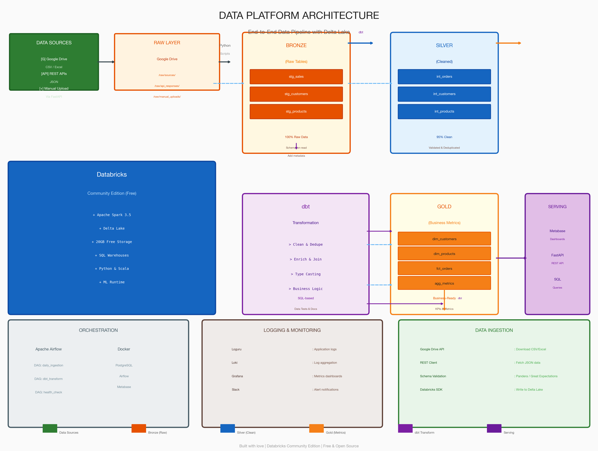

# Data Platform

> Nền tảng xử lý dữ liệu doanh nghiệp - ETL, Data Warehouse, Business Intelligence

## 🎯 Tổng Quan

Data Platform là một hệ thống xử lý dữ liệu end-to-end được thiết kế cho doanh nghiệp vừa và nhỏ. Hệ thống sử dụng các công nghệ cloud-native miễn phí, cho phép bắt đầu với chi phí thấp và mở rộng theo nhu cầu.

**Tác giả:** Dư Quốc Việt  
**Email:** duviet720@gmail.com

---

## 🏗️ Kiến Trúc Tổng Quan



---

## 🔄 Data Flow

```
┌──────────────────────────────────────────────────────────────────────────────────┐
│  STEP 1: INGESTION (Python Scripts)                                            │
├──────────────────────────────────────────────────────────────────────────────────┤
│                                                                                  │
│   Google Drive          Python Script            Databricks                       │
│   ┌──────────┐        ┌─────────────┐         ┌──────────────────┐            │
│   │ sales_   │──────▶│ Google      │───────▶│  Bronze Layer     │            │
│   │   2024.csv │        │ Drive API   │         │  stg_sales        │            │
│   └──────────┘        └─────────────┘         └──────────────────┘            │
│                               │                                                 │
│   ┌──────────┐        ┌─────────────┐         ┌──────────────────┐            │
│   │ customers│──────▶│ Download   │───────▶│  Bronze Layer     │            │
│   │ .csv    │        │ Files      │         │  stg_customers   │            │
│   └──────────┘        └─────────────┘         └──────────────────┘            │
│                               │                                                 │
│   ┌──────────┐        ┌─────────────┐         ┌──────────────────┐            │
│   │ products │──────▶│ Validate   │───────▶│  Bronze Layer     │            │
│   │ .xlsx   │        │ Schema     │         │  stg_products    │            │
│   └──────────┘        └─────────────┘         └──────────────────┘            │
│                                                                                  │
└──────────────────────────────────────────────────────────────────────────────────┘

┌──────────────────────────────────────────────────────────────────────────────────┐
│  STEP 2: TRANSFORMATION (dbt)                                                    │
├──────────────────────────────────────────────────────────────────────────────────┤
│                                                                                  │
│   Bronze Layer          dbt                Silver Layer           Gold Layer       │
│   ┌──────────┐       ┌──────┐        ┌──────────────┐     ┌─────────────────┐  │
│   │ stg_     │─────▶│ Clean│──────▶│ int_orders   │────▶│ dim_customers   │  │
│   │ sales    │       │ Dedupe│        │ _clean       │     │ dim_products    │  │
│   └──────────┘       │ Valid│        └──────────────┘     │ fct_orders      │  │
│                       │ Trans│                                  └─────────────────┘  │
│   ┌──────────┐       └──────┘        ┌──────────────┐                             │
│   │ stg_     │─────▶│ Enrich │──────▶│ int_customers│                             │
│   │ customers│       │ Join  │        │ _enriched     │                             │
│   └──────────┘       └──────┘        └──────────────┘                             │
│                                                                                  │
└──────────────────────────────────────────────────────────────────────────────────┘

┌──────────────────────────────────────────────────────────────────────────────────┐
│  STEP 3: VISUALIZATION (Metabase)                                               │
├──────────────────────────────────────────────────────────────────────────────────┤
│                                                                                  │
│   Gold Layer              Metabase                Dashboard                       │
│   ┌──────────┐       ┌─────────────┐         ┌──────────────────┐            │
│   │ fct_     │─────▶│  SQL Query  │───────▶│  Executive        │            │
│   │ orders   │       │             │         │  Overview         │            │
│   └──────────┘       └─────────────┘         └──────────────────┘            │
│                          │                                                 │
│   ┌──────────┐       ┌─────────────┐         ┌──────────────────┐            │
│   │ dim_     │─────▶│  SQL Query  │───────▶│  Sales            │            │
│   │ customers │       │             │         │  Dashboard        │            │
│   └──────────┘       └─────────────┘         └──────────────────┘            │
│                                                                                  │
└──────────────────────────────────────────────────────────────────────────────────┘
```

---

## 🛠️ Tech Stack

### 🗄️ Storage Layer
| Technology | Purpose | Notes |
|------------|---------|-------|
| **Google Drive** | Raw Data Storage | Free Shared Drive |
| **Databricks DBFS** | Delta Lake Storage | Free tier: 20GB |
| **Delta Lake** | Data Lakehouse | ACID transactions |

### ⚙️ Processing Layer
| Technology | Purpose | Notes |
|------------|---------|-------|
| **Databricks Community** | Data Processing | Free forever |
| **Apache Spark** | Distributed Computing | Built-in |
| **Python** | Scripting | pandas, pyspark |
| **dbt-databricks** | Data Transformation | SQL-based |

### 🎛️ Orchestration
| Technology | Purpose | Notes |
|------------|---------|-------|
| **Apache Airflow** | Workflow Orchestration | Local Docker |
| **Docker Compose** | Container Management | Local dev |

### 📊 Analytics & BI
| Technology | Purpose | Notes |
|------------|---------|-------|
| **Metabase** | Dashboard & BI | Free, Mac-friendly |
| **SQL** | Query Language | Databricks SQL |

### 🌐 API Layer
| Technology | Purpose | Notes |
|------------|---------|-------|
| **FastAPI** | REST API | Python async |
| **Pydantic** | Data Validation | Type safety |

### 📝 Logging & Monitoring
| Technology | Purpose | Notes |
|------------|---------|-------|
| **Loguru** | Application logs | Easy logging |
| **Loki** | Log aggregation | Lightweight |
| **Grafana** | Metrics visualization | Optional |

---

## 🗂️ Cấu Trúc Thư Mục

```
data-platform/
├── 📁 apps/                    # Application code
│   ├── 📁 api/                # FastAPI application
│   └── 📁 web/                # Web interface
├── 📁 libs/                   # Shared libraries
│   ├── 📁 ingestion/          # Data ingestion scripts
│   ├── 📁 transformation/     # dbt models
│   └── 📁 utils/              # Utilities
├── 📁 airflow/                # Airflow DAGs
│   ├── 📁 dags/
│   └── 📁 plugins/
├── 📁 docs/                   # Documentation
│   ├── 📁 architecture/       # Architecture docs
│   ├── 📁 setup/              # Setup guides
│   ├── 📁 pipelines/          # Pipeline docs
│   └── 📁 runbooks/           # Operations guides
├── 📁 scripts/                # Shell scripts
├── 📁 tests/                  # Test suite
├── 📄 docker-compose.yml      # Container orchestration
├── 📄 requirements.txt        # Python dependencies
└── 📄 README.md              # This file
```

---

## 🚀 Quick Start

### Prerequisites
- macOS 12+ (Monterey or later)
- Python 3.11+
- Docker Desktop
- Google Drive API credentials

### Installation

```bash
# Clone repository
git clone https://github.com/viet-du/data-platfrom.git
cd data-platfrom

# Create virtual environment
python -m venv venv
source venv/bin/activate

# Install dependencies
pip install -r requirements.txt

# Setup environment variables
cp .env.example .env
# Edit .env with your credentials

# Start services
docker-compose up -d

# Run ingestion
python libs/ingestion/run.py

# Run transformation
dbt run

# Access dashboards
# Metabase: http://localhost:3000
# Airflow: http://localhost:8080
```

---

## 📋 Features

### ✅ Data Ingestion
- Google Drive integration for CSV/Excel files
- REST API support for JSON data
- Manual upload via FastAPI
- Schema validation on import

### ✅ Data Transformation
- dbt models for Bronze → Silver → Gold
- Data quality tests
- Slowly Changing Dimensions (SCD)
- Incremental loads

### ✅ Dashboards
- Executive overview dashboard
- Sales analytics
- Customer insights
- Product performance
- Marketing metrics

### ✅ Monitoring & Logging
- Pipeline execution logging
- Data quality checks
- Error alerting
- Slack notifications

---

## 📚 Documentation

| Document | Description |
|----------|-------------|
| [Architecture Overview](docs/architecture/architecture-overview.md) | System architecture details |
| [Data Flow](docs/architecture/data-flow.md) | Data pipeline flow |
| [Tech Stack](docs/architecture/tech-stack.md) | Technology stack details |
| [Databricks Setup](docs/setup/databricks-setup.md) | Databricks configuration |
| [Local Environment](docs/setup/local-environment.md) | Development setup |
| [Ingestion Guide](docs/pipelines/ingestion-guide.md) | Data ingestion |
| [Transformation Guide](docs/pipelines/transformation-guide.md) | Data transformation |

---

## 🔗 Liên Kết

- **GitHub:** https://github.com/viet-du/data-platfrom
- **Databricks:** https://community.cloud.databricks.com
- **Metabase:** http://localhost:3000
- **Airflow:** http://localhost:8080

---

## 👤 Tác Giả

**Dư Quốc Việt**  
Email: duviet720@gmail.com

---

## 📄 License

MIT License - Xem [LICENSE](LICENSE) để biết thêm chi tiết.
